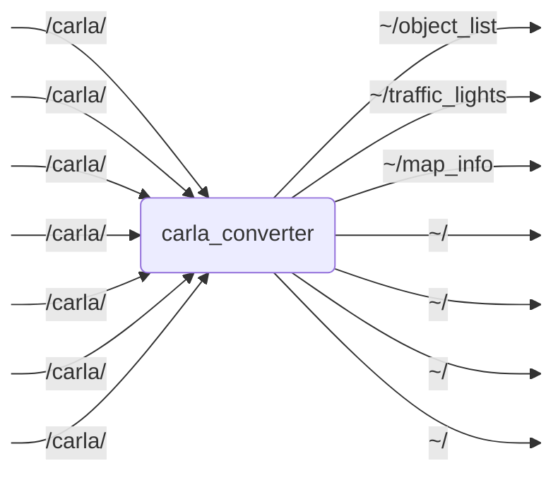

# `carla_converter`

Converter for CARLA specific ROS 2 data to OpenADS interfaces.

## Nodes

### `carla_converter`

#### Subscribed Topics

| Topic | Type | Description |
| --- | --- | --- |
| `/carla/` | `nm/Odometry` | TODO |
| `/carla/` | `cm/CarlaEgoVehicleStatus` | TODO |
| `/carla/` | `cm/CarlaEgoVehicleInfo` | TODO |
| `/carla/` | `ssm/NavSatFix` | TODO |
| `/carla/` | `ssm/Imu` | TODO |
| `/carla/` | `cm/CarlaEgoVehicleInfo` | TODO |
| `/carla/` | `dom/ObjectArray` | TODO |

#### Published Topics

| Topic | Type | Description |
| --- | --- | --- |
| `~/object_list` | `pi/ObjectList` | TODO |
| `~/traffic_lights` | `pi/ObjectList` | TODO |
| `~/map_info` | `stm/String` | TODO |
| `~/` | `pi/EgoData` | TODO |
| `~/` | `pi/ObjectList` | TODO |
| `~/` | `pi/ObjectList` | TODO |

#### Parameters

| Parameter | Type | Default | Description |
| --- | --- | --- | --- |
| `ego_data_actors` | `string` | `"ego_vehicle"` | Comma-separated list of actor names to publish ego data for |
| `object_list_actors` | `string` | `"ego_vehicle"` | Comma-separated list of actor names to publish object lists for |
| `pos_variances` | `float` | `oa::CONTINUOUS_STATE_COVARIANCE_INVALID` | Position covariance value |
| `vel_variances` | `float` | `oa::CONTINUOUS_STATE_COVARIANCE_INVALID` | Velocity covariance value |
| `acc_variances` | `float` | `oa::CONTINUOUS_STATE_COVARIANCE_INVALID` | Acceleration covariance value |
| `angle_variances` | `float` | `oa::CONTINUOUS_STATE_COVARIANCE_INVALID` | Angle covariance value |
| `angle_rate_variances` | `float` | `oa::CONTINUOUS_STATE_COVARIANCE_INVALID` | Angle rate covariance value |
| `enable_traffic_lights` | `bool` | `false` | Enable traffic light subscriptions and publishing |
| `traffic_light_frequency` | `float` | `10.0` | Publishing frequency for traffic lights in Hz |
| `carla_fixed_frame_id` | `string` | `"carla_map"` | Fixed frame ID used for the CARLA map |

## Launch Files

### [`carla_converter.launch.py`](launch/carla_converter.launch.py)

| Argument | Default | Description |
| --- | --- | --- |
| `object_list_topic` | `"~/object_list"` | output topic for converted object list |
| `traffic_lights_topic` | `"~/traffic_lights"` | output topic for converted traffic lights |
| `map_info_topic` | `"~/map_info"` | output topic for map info |
| `name` | `"carla_converter"` | node name |
| `namespace` | `""` | node namespace |
| `params` | `os.path.join(get_package_share_directory("carla_converter"), "config", "params.yml")` | path to parameter file |
| `log_level` | `"info"` | ROS logging level (debug, info, warn, error, fatal) |
| `use_sim_time` | `"true"` | use simulation clock |

### [`transforms.launch.py`](launch/transforms.launch.py)
