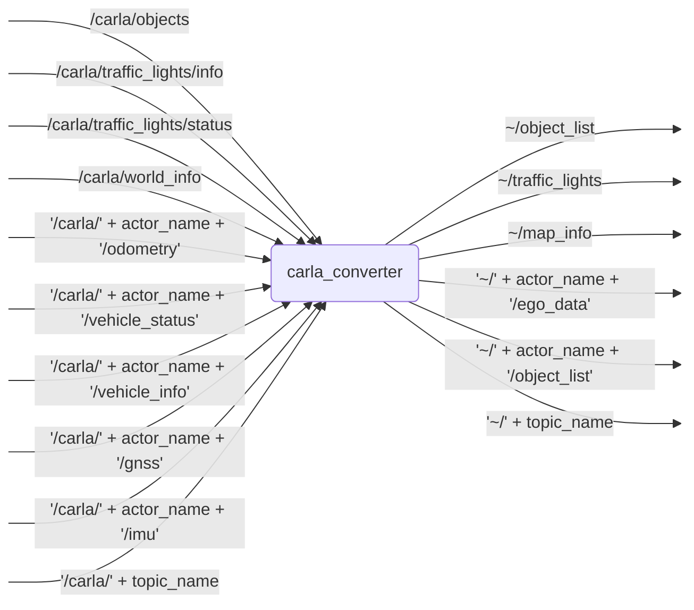

# `carla_converter`

Converter for CARLA specific ROS 2 data to OpenADS interfaces.

## Nodes

### `carla_converter`

#### Subscribed Topics

| Topic | Type | Description |
| --- | --- | --- |
| `/carla/objects` | `derived_object_msgs/msg/ObjectArray` | Objects in the CARLA environment |
| `/carla/traffic_lights/info` | `carla_msgs/msg/CarlaTrafficLightInfoList` | Global traffic light information |
| `/carla/traffic_lights/status` | `carla_msgs/msg/CarlaTrafficLightStatusList` | Global traffic light status |
| `/carla/world_info` | `carla_msgs/msg/CarlaWorldInfo` | CARLA world/map info |
| `"/carla/" + actor_name + "/odometry"` | `nav_msgs/msg/Odometry` | Odometry for each actor from `ego_data_actors` |
| `"/carla/" + actor_name + "/vehicle_status"` | `carla_msgs/msg/CarlaEgoVehicleStatus` | Vehicle status for each actor from `ego_data_actors` |
| `"/carla/" + actor_name + "/vehicle_info"` | `carla_msgs/msg/CarlaEgoVehicleInfo` | Vehicle metadata for actors from `ego_data_actors` and `object_list_actors` |
| `"/carla/" + actor_name + "/gnss"` | `sensor_msgs/msg/NavSatFix` | GNSS fix for each actor from `ego_data_actors` |
| `"/carla/" + actor_name + "/imu"` | `sensor_msgs/msg/Imu` | IMU data for each actor from `ego_data_actors` |
| `"/carla/" + topic_name` | `derived_object_msgs/msg/ObjectArray` | Custom CARLA ObjectArray topics that are subscribed and converted automatically |

#### Published Topics

| Topic | Type | Description |
| --- | --- | --- |
| `~/object_list` | `perception_msgs/msg/ObjectList` | output topic for converted object list |
| `~/traffic_lights` | `perception_msgs/msg/ObjectList` | output topic for converted traffic lights |
| `~/map_info` | `std_msgs/msg/String` | output topic for map info |
| `"~/" + actor_name + "/ego_data"` | `perception_msgs/msg/EgoData` | Ego state for each actor from `ego_data_actors` |
| `"~/" + actor_name + "/object_list"` | `perception_msgs/msg/ObjectList` | Object list transformed into each actor frame from `object_list_actors` |
| `"~/" + topic_name` | `perception_msgs/msg/ObjectList` | Converted output for each custom CARLA ObjectArray topic |

#### Parameters

| Parameter | Type | Default | Description |
| --- | --- | --- | --- |
| `ego_data_actors` | `string` | `"ego_vehicle"` | Comma-separated list of actor names to publish ego data for |
| `object_list_actors` | `string` | `"ego_vehicle"` | Comma-separated list of actor names to publish object lists for |
| `pos_variances` | `float` | `oa::CONTINUOUS_STATE_COVARIANCE_INVALID` | Position covariance value |
| `vel_variances` | `float` | `oa::CONTINUOUS_STATE_COVARIANCE_INVALID` | Velocity covariance value |
| `acc_variances` | `float` | `oa::CONTINUOUS_STATE_COVARIANCE_INVALID` | Acceleration covariance value |
| `angle_variances` | `float` | `oa::CONTINUOUS_STATE_COVARIANCE_INVALID` | Angle covariance value |
| `angle_rate_variances` | `float` | `oa::CONTINUOUS_STATE_COVARIANCE_INVALID` | Angle rate covariance value |
| `enable_traffic_lights` | `bool` | `false` | Enable traffic light subscriptions and publishing |
| `traffic_light_frequency` | `float` | `10.0` | Publishing frequency for traffic lights in Hz |
| `carla_fixed_frame_id` | `string` | `"carla_map"` | Fixed frame ID used for the CARLA map |

## Launch Files

### [`carla_converter.launch.py`](launch/carla_converter.launch.py)

| Argument | Default | Description |
| --- | --- | --- |
| `object_list_topic` | `"~/object_list"` | output topic for converted object list |
| `traffic_lights_topic` | `"~/traffic_lights"` | output topic for converted traffic lights |
| `map_info_topic` | `"~/map_info"` | output topic for map info |
| `name` | `"carla_converter"` | node name |
| `namespace` | `""` | node namespace |
| `params` | `os.path.join(get_package_share_directory("carla_converter"), "config", "params.yml")` | path to parameter file |
| `log_level` | `"info"` | ROS logging level (debug, info, warn, error, fatal) |
| `use_sim_time` | `"true"` | use simulation clock |

### [`transforms.launch.py`](launch/transforms.launch.py)
